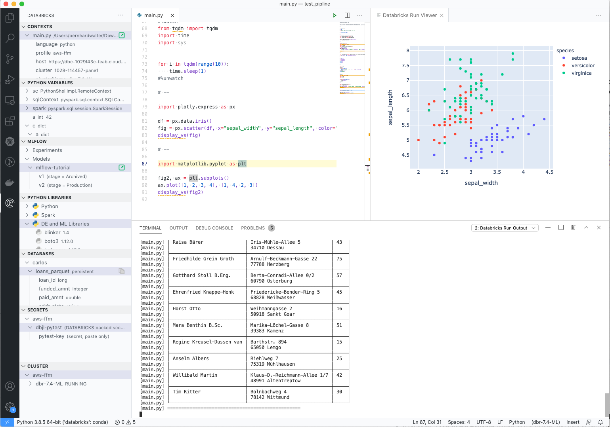
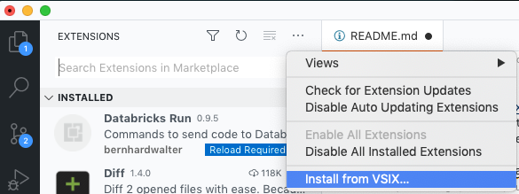

# Databricks Run

Use Databricks [Context/Command API](https://docs.databricks.com/dev-tools/api/1.2/index.html#execution-context) to send single lines or selected code block to a remote Databricks cluster directly from VS Code - plus a bunch of tools to provide info about the remote cluster in your local VS Code.


## Features

- Supports Python, SQL, Scala and R (R more experimental).
- It provides a **Cluster Explorer** where all connectd clusters are visible and can started/restarted/stopped
- It provides a **Database Explorer** where all databases and their schema can be browsed. Databse, table and column names can be pasted into the current file with a click
- The main language is Python for which the extension provides:
    - **%pip** support to install "notebook scoped" libraries
    - **%sh** support to execute shell commands on the driver
    - A table view of dataframes via `display`
    - A web view for plotly graphics via `display_vs_`
    - Many Explorers to view info on the workspace and clusters
        - A **Variable Explorer** to inspect the variables of the remote cluster in VS Code. Pandas and Spark dataframe columns can be pasted into the current file with a click
        - A **Library Explorer** to see installed libraries on the cluster and compare version with the local environment. With a single click, library version of the cluster can be installed locally. Additinally a `env.yaml` file can be created to replicate a remote cluster environment locally
        - A **Secrets Explorer** that allows to browse secrets and copy the `dbutils` command to your code
        - A **Database Explorer** that allows to browse databases and tables and copy database and table names to your code
        - An **MLflow Explorer** that allows to browse experiments and models and directly jump to the Managed MLflow webpages
        - A **Cluster Explorer** that allows to start/restart/stop clusters and jump directly to the Spark UI


## How to start

- Download the extension `databricks-run-0.9.5.vsix` from the [Release page](https://github.com/bernhard-42/db-12-vscode/releases) and install it in VS Code.

    

- For authentication it uses `~/databrickscfg`. Either you have Databricks CLI already installed or you create an ini file of the form

    ```bash
    [dev]
    host = https://dev.cloud.databricks.com
    token = dapi

    [prod]
    host = https://prod.cloud.databricks.com
    token = dapi
    ```

Databricks Run for VS Code comes with four commands (cmd-shift-P or ctrl-shift-P):

- **Databricks Run: Initialize a Databricks Connection** (*cmd-k shift-I*)
    This will create an execution context for the current file (needs to be py, sql, scala or r)

- **Databricks Run: Send selection or line** (*cmd-k shift-enter*)
    This will send the current line or the selection to the execution context created for this file

- **Databricks Run: Send block** (*cmd-k ctrl-enter*)
    This will send the block delimited by `# --' markers to the execution context created for this file

- **Databricks Run: Cancel the currently running command** (*cmd-k shift-I*)
    This will cancel a long running command on the Databricks cluster (e.g. a SPark job)

- **Databricks Run: Stop the Databricks Connection** (*cmd-k shift-S*)
    This will finally close the execution context for the current file

Start with *cmd-k shift-I* and switch to the Databricks Run view!

Note: On Windows, instead of `cmd` use the `ctrl` key.

## Known Issues

None

## Release Notes

- **0.1.0**
    - Initial release
- **0.2.0**
    - Added support of libraries
    - Refactored to remove API 1.2 references
- **0.3.0**
    - Removed language as a setting
- **0.9.0**
    - More explorers (databases, clusters, libraries)
    - Configuration is now outside of .vscode
    - Complete task build systems
- **0.9.2**
    - Added watch feature
- **0.9.3**
    - New MLflow experiments browser for MLflow tracking server
- **0.9.4**
    - MLflow browser now also supports models of the MLflow model registry
- **0.9.5**
    - Added Link to Spark UI
    - Magics #%pip and #%sh
    - Support cmd-K ctrl-k (or ctrl-k ctrl-k on windows) to send block between "# --" markers
    - When clicking on centext, both, code and terminal are getting focus
